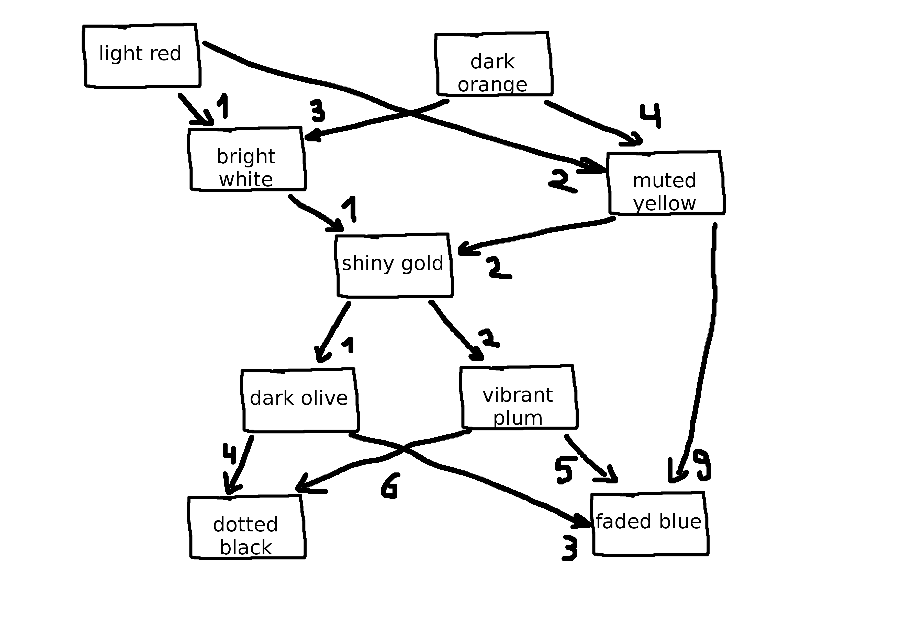

# Advent of Code 2020 - Day 7

https://adventofcode.com/2020/day/7

## Part 1

We should be able to model the input data as a [Directed acyclic graph](https://en.wikipedia.org/wiki/Directed_acyclic_graph). Here is the example visualized:

Once the graph data structure is in place, we can have a recursive procedure traverse the graph starting from a given vertex and return boolean if `shiny gold` can be found.

## Part 2

For Part 2 we should be able to implement another recursive procedure which counts up the number of bags at each step using the edge cost.
